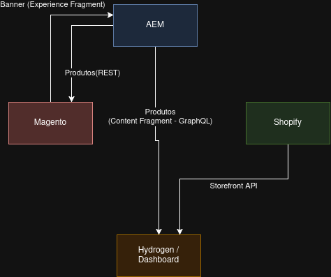

# Projeto Integrado - Bootcamp 2026

---

## 🧩 Arquitetura

---

## 🔄 Fluxos de Integração

### 1. Commerce → AEM (Dia 15)

* Adobe Commerce expõe catálogo via API REST
* AEM consome via Sling Model (`HttpURLConnection`)
* Componente **Product Showcase** renderiza produtos

**Endpoint:**
`GET /V1/bootcamp/products`

---

### 2. Shopify → Hydrogen (Dia 16)
*(Não implementado)*

* Shopify gerencia catálogo via Admin
* Hydrogen consome via **Storefront API (GraphQL)**
* Storefront headless com React/Remix

---

### 3. AEM → Hydrogen (Dia 17)

* AEM gerencia Content Fragments
* Hydrogen consome via GraphQL (ex: página `/about`)

**Endpoint:**
`POST /content/cq:graphql/global/endpoint.json`

---

### 4. AEM → Commerce (Dia 17)

* AEM gerencia Experience Fragments (banners/promos)
* Commerce consome via JSON Export

**Endpoint:**
`GET /content/experience-fragments/bootcamp-wknd/us/en/banner-promo-bootcamp/master.model.json`

---

### 5. Dashboard de Integração (Dia 18)
*(Não implementado)*

* Hydrogen agrega dados das três plataformas (Commerce, AEM e Shopify)
* Consumo paralelo de APIs com `Promise.allSettled`

**Rota:**
`/dashboard`

---

## 📊 Tabela de Endpoints

| Plataforma | Tipo    | URL                     | Auth       |
| ---------- | ------- | ----------------------- | ---------- |
| Commerce   | REST    | /V1/bootcamp/products   | Anonymous  |
| AEM        | GraphQL | /content/cq:graphql/global/endpoint.json | Basic Auth |
| AEM        | JSON    | /content/experience-fragments/bootcamp-wknd/us/en/banner-promo-bootcamp/master.model.json   | Basic Auth |
| Shopify    | GraphQL | Storefront API (não impl.) | Token      |

---

## 📝 Descrição

Este repositório contém um monorepo com dois projetos independentes integrados:

- **bootcamp-commerce/**: Instância Magento 2.4.8-p4 com desenvolvimento customizado de módulos e integrações via API REST
- **bootcamp-wknd/**: Projeto Adobe Experience Manager (AEM) Maven multi-module para gerenciamento de conteúdo e experiência

A integração entre as plataformas é realizada através de 5 fluxos principais que conectam Commerce e AEM, permitindo sincronização de catálogo e conteúdo. Os fluxos envolvendo Shopify/Hydrogen não foram implementados.

---

## 📂 Subprojetos

Consulte o README.md dentro de cada subpasta para instruções específicas:

- **[bootcamp-commerce/](bootcamp-commerce/README.md)** - Magento 2 com módulos customizados
- **[bootcamp-wknd/](bootcamp-wknd/README.md)** - AEM com componente ProductShowcase
